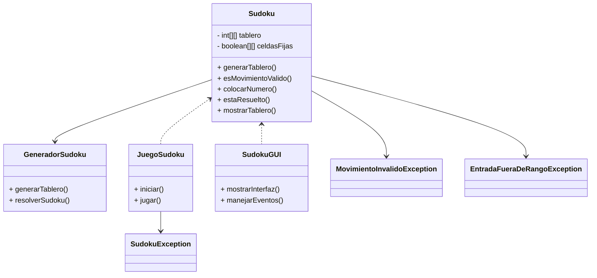

#  Proyecto Sudoku – Documentación

##  Análisis de Requerimientos

###  Objetivos
Desarrollar una aplicación de escritorio en Java que permita jugar al clásico Sudoku con:
- Validación de jugadas en tiempo real.
- Diferentes niveles de dificultad.
- Interfaz tanto en consola como gráfica (Swing/JavaFX).
- Uso de programación orientada a objetos y estructuras de datos.

---

###  Requisitos Funcionales

| ID  | Requisito Funcional                                                                 |
|-----|--------------------------------------------------------------------------------------|
| RF1 | Generar tableros de Sudoku válidos con dificultad fácil, media y difícil.           |
| RF2 | Permitir al usuario introducir valores en el tablero, excepto en celdas fijas.      |
| RF3 | Validar en tiempo real que los movimientos cumplen las reglas del Sudoku.           |
| RF4 | Verificar automáticamente si el tablero está completamente y correctamente resuelto.|
| RF5 | Mostrar el tablero y mensajes claros desde consola o GUI.                           |

---

###  Requisitos No Funcionales

| ID  | Requisito No Funcional                                                                 |
|-----|------------------------------------------------------------------------------------------|
| RNF1 | El sistema debe estar desarrollado en Java utilizando POO.                             |
| RNF2 | La interfaz (consola o gráfica) debe ser clara e intuitiva.                            |
| RNF3 | El código debe incluir manejo robusto de errores y excepciones personalizadas.         |
| RNF4 | Deben implementarse pruebas unitarias con JUnit para métodos clave.                    |
| RNF5 | El código debe estar correctamente comentado y documentado.                            |

---

##  Matriz de Trazabilidad

| Req. | Clase / Método                    | Tipo de Prueba    | Excepción relacionada                   |
|------|-----------------------------------|-------------------|------------------------------------------|
| RF1  | `GeneradorSudoku.generarTablero` | Positiva          | -                                        |
| RF2  | `Sudoku.colocarNumero`           | Positiva / Negativa| `MovimientoInvalidoException`            |
| RF3  | `Sudoku.esMovimientoValido`      | Negativa / Borde  | `MovimientoInvalidoException`            |
| RF4  | `Sudoku.estaResuelto`            | Positiva          | -                                        |
| RF5  | `JuegoSudoku` / `SudokuGUI`      | Visual / Positiva | `EntradaFueraDeRangoException`           |
| RNF1 | Código en Java con OOP           | Validación manual | -                                        |
| RNF2 | Interfaz gráfica (`SudokuGUI`)   | Usabilidad        | -                                        |
| RNF3 | Excepciones personalizadas       | Pruebas negativas | `SudokuException`, otras personalizadas  |
| RNF4 | Paquete de pruebas JUnit         | Unitarias         | -                                        |
| RNF5 | Comentarios y Javadoc            | Revisión manual   | -                                        |

---

##  Diagrama de Clases (Mermaid)



## Código Fuente

El código fuente se encuentra en la carpeta `src/` e incluye las siguientes clases:

- `Sudoku`: Lógica del juego.

public class Sudoku {
    private int[][] tablero;
    private boolean[][] celdasFijas;

    public Sudoku() {
        tablero = new int[9][9];
        celdasFijas = new boolean[9][9];
    }

    public void setTablero(int[][] nuevoTablero, boolean[][] nuevasCeldasFijas) {
        tablero = new int[9][9];
        celdasFijas = new boolean[9][9];
        for (int i = 0; i < 9; i++) {
            System.arraycopy(nuevoTablero[i], 0, tablero[i], 0, 9);
            System.arraycopy(nuevasCeldasFijas[i], 0, celdasFijas[i], 0, 9);
        }
    }

    public boolean esMovimientoValido(int fila, int columna, int valor) {
        if (valor < 1 || valor > 9) return false;

        // Verificar fila (ignorar la celda actual)
        for (int i = 0; i < 9; i++) {
            if (i != columna && tablero[fila][i] == valor) return false;
        }

        // Verificar columna (ignorar la celda actual)
        for (int i = 0; i < 9; i++) {
            if (i != fila && tablero[i][columna] == valor) return false;
        }

        // Verificar caja 3x3 (ignorar la celda actual)
        int startRow = fila - fila % 3;
        int startCol = columna - columna % 3;
        for (int r = startRow; r < startRow + 3; r++) {
            for (int c = startCol; c < startCol + 3; c++) {
                if ((r != fila || c != columna) && tablero[r][c] == valor) return false;
            }
        }

        return true;
    }

    public boolean colocarNumero(int fila, int columna, int valor) throws SudokuException {
        if (valor < 1 || valor > 9) {
            throw new OutOfRangeException(valor);
        }

        if (celdasFijas[fila][columna]) {
            throw new InvalidMovementException(fila + 1, columna + 1, valor);
        }

        if (!esMovimientoValido(fila, columna, valor)) {
            throw new InvalidMovementException(fila + 1, columna + 1, valor);
        }

        tablero[fila][columna] = valor;
        return true;
    }

    public boolean estaResuelto() {
        for (int fila = 0; fila < 9; fila++) {
            for (int columna = 0; columna < 9; columna++) {
                int valor = tablero[fila][columna];
                if (valor == 0) {
                    System.out.println("Casilla vacía en fila " + fila + ", columna " + columna);
                    return false;
                }

                // Guardar valor temporalmente
                tablero[fila][columna] = 0;

                if (!esMovimientoValido(fila, columna, valor)) {
                    System.out.println("Conflicto con valor " + valor + " en fila " + fila + ", columna " + columna);
                    tablero[fila][columna] = valor;
                    return false;
                }

                // Restaurar valor
                tablero[fila][columna] = valor;
            }
        }
        return true;
    }

    public int[][] getTablero() {
        return tablero;
    }

    public boolean[][] getCeldasFijas() {
        return celdasFijas;
    }
}

- `GeneradorSudoku`: Algoritmo de backtracking para generar tableros válidos.

import java.util.Random;

public class GeneradorSudoku {

    // Clase para devolver el tablero visible y la solución completa
    public static class TableroConSolucion {
        public int[][] tableroVisible;
        public int[][] solucionCompleta;

        public TableroConSolucion(int[][] visible, int[][] solucion) {
            this.tableroVisible = visible;
            this.solucionCompleta = solucion;
        }
    }

    // Nuevo método que devuelve tablero visible + solución, según dificultad
    public static TableroConSolucion generarTableroConSolucion(String dificultad) {
        int[][] solucion = generarTableroCompleto();
        int[][] visible = copiarMatriz(solucion);

        int vacias = switch (dificultad.toLowerCase()) {
            case "facil" -> 30;
            case "medio" -> 40;
            case "dificil" -> 50;
            default -> throw new IllegalArgumentException("Dificultad no válida");
        };

        eliminarCasillas(visible, vacias);
        return new TableroConSolucion(visible, solucion);
    }

    // Método original que solo devuelve el tablero con huecos (opcional si quieres mantenerlo)
    public static int[][] generarTablero(String dificultad) {
        int[][] tableroCompleto = generarTableroCompleto();
        int[][] tableroConHuecos = copiarMatriz(tableroCompleto);

        int casillasVacías;
        switch (dificultad.toLowerCase()) {
            case "facil" -> casillasVacías = 30;
            case "medio" -> casillasVacías = 40;
            case "dificil" -> casillasVacías = 50;
            default -> throw new IllegalArgumentException("Dificultad no válida");
        }

        eliminarCasillas(tableroConHuecos, casillasVacías);
        return tableroConHuecos;
    }

    public static boolean[][] generarCeldasFijas(int[][] tablero) {
        boolean[][] fijas = new boolean[9][9];
        for (int fila = 0; fila < 9; fila++) {
            for (int col = 0; col < 9; col++) {
                fijas[fila][col] = tablero[fila][col] != 0;
            }
        }
        return fijas;
    }

    private static int[][] generarTableroCompleto() {
        int[][] tablero = new int[9][9];
        llenar(tablero, 0, 0);
        return tablero;
    }

    private static boolean llenar(int[][] tablero, int fila, int col) {
        if (fila == 9) return true;
        if (col == 9) return llenar(tablero, fila + 1, 0);

        Random rand = new Random();
        int[] numeros = rand.ints(1, 10).distinct().limit(9).toArray();

        for (int num : numeros) {
            if (esValido(tablero, fila, col, num)) {
                tablero[fila][col] = num;
                if (llenar(tablero, fila, col + 1)) return true;
                tablero[fila][col] = 0;
            }
        }
        return false;
    }

    private static boolean esValido(int[][] tablero, int fila, int col, int val) {
        for (int i = 0; i < 9; i++) {
            if (tablero[fila][i] == val || tablero[i][col] == val) return false;
        }
        int startRow = fila - fila % 3;
        int startCol = col - col % 3;
        for (int r = startRow; r < startRow + 3; r++) {
            for (int c = startCol; c < startCol + 3; c++) {
                if (tablero[r][c] == val) return false;
            }
        }
        return true;
    }

    private static void eliminarCasillas(int[][] tablero, int cantidad) {
        Random rand = new Random();
        int eliminadas = 0;

        while (eliminadas < cantidad) {
            int fila = rand.nextInt(9);
            int col = rand.nextInt(9);
            if (tablero[fila][col] != 0) {
                tablero[fila][col] = 0;
                eliminadas++;
            }
        }
    }

    private static int[][] copiarMatriz(int[][] original) {
        int[][] copia = new int[9][9];
        for (int i = 0; i < 9; i++) {
            System.arraycopy(original[i], 0, copia[i], 0, 9);
        }
        return copia;
    }
}

- `JuegoSudoku`: Modo consola.

import java.util.Scanner;

public class JuegoSudoku {
    private final Scanner scanner = new Scanner(System.in);
    private final Sudoku sudoku = new Sudoku();

    public void iniciar() {
        System.out.println("========== SUDOKU ==========");
        System.out.println("Selecciona la dificultad: fácil | medio | difícil");
        String dificultad = scanner.nextLine().toLowerCase();

        int[][] tableroInicial = GeneradorSudoku.generarTablero(dificultad);
        boolean[][] celdasFijas = GeneradorSudoku.generarCeldasFijas(tableroInicial);
        sudoku.setTablero(tableroInicial, celdasFijas);

        while (true) {
            mostrarTablero();
            if (sudoku.estaResuelto()) {
                System.out.println("🎉 ¡Felicidades! Has completado el Sudoku.");
                break;
            }

            System.out.println("Introduce tu jugada (fila columna valor) o escribe 'salir':");
            String entrada = scanner.nextLine();

            if (entrada.equalsIgnoreCase("salir")) {
                System.out.println("Juego terminado. ¡Hasta luego!");
                break;
            }

            try {
                String[] partes = entrada.trim().split("\\s+");
                if (partes.length != 3) throw new IllegalArgumentException("Formato inválido.");

                int fila = Integer.parseInt(partes[0]) - 1;
                int columna = Integer.parseInt(partes[1]) - 1;
                int valor = Integer.parseInt(partes[2]);

                sudoku.colocarNumero(fila, columna, valor);

            } catch (SudokuException e) {
                System.out.println("❌ " + e.getMessage());
            } catch (Exception e) {
                System.out.println("⚠️ Entrada no válida. Usa: fila columna valor (ej. 3 4 7)");
            }
        }
    }

    private void mostrarTablero() {
        int[][] tablero = sudoku.getTablero();
        System.out.println("\n   1 2 3   4 5 6   7 8 9");
        for (int fila = 0; fila < 9; fila++) {
            if (fila % 3 == 0) System.out.println("  +-------+-------+-------+");
            System.out.print((fila + 1) + " |");
            for (int col = 0; col < 9; col++) {
                int val = tablero[fila][col];
                System.out.print((val == 0 ? " " : val) + ((col + 1) % 3 == 0 ? " |" : " "));
            }
            System.out.println();
        }
        System.out.println("  +-------+-------+-------+\n");
    }

    public static void main(String[] args) {
        JuegoSudoku juego = new JuegoSudoku();
        juego.iniciar();
    }
}

- `SudokuGUI`: Interfaz gráfica con Swing o JavaFX.

import javafx.application.Application;
import javafx.geometry.Pos;
import javafx.scene.Scene;
import javafx.scene.control.*;
import javafx.scene.layout.*;
import javafx.stage.Stage;

public class SudokuGUI extends Application {

    private Sudoku sudoku = new Sudoku();
    private TextField[][] campos = new TextField[9][9];
    private int[][] solucion;

    @Override
    public void start(Stage primaryStage) {
        String dificultad = pedirDificultad();
        GeneradorSudoku.TableroConSolucion data = GeneradorSudoku.generarTableroConSolucion(dificultad);
        int[][] tableroVisible = data.tableroVisible;
        solucion = data.solucionCompleta;

        boolean[][] fijas = GeneradorSudoku.generarCeldasFijas(tableroVisible);
        sudoku.setTablero(tableroVisible, fijas);
        final boolean[][] fijasFinal = fijas;

        GridPane grid = new GridPane();
        grid.setAlignment(Pos.CENTER);
        grid.setVgap(2);
        grid.setHgap(2);
        grid.setStyle("-fx-padding: 20; -fx-background-color: #f4f4f4;");

        for (int fila = 0; fila < 9; fila++) {
            for (int col = 0; col < 9; col++) {
                TextField campo = new TextField();
                campo.setPrefSize(50, 50);
                campo.setAlignment(Pos.CENTER);
                int valor = tableroVisible[fila][col];

                if (valor != 0) {
                    campo.setText(String.valueOf(valor));
                    campo.setDisable(true);
                    campo.setStyle("-fx-background-color: #dcdcdc;");
                }

                final int f = fila;
                final int c = col;

                campo.setOnAction(e -> {
                    try {
                        int input = Integer.parseInt(campo.getText());
                        sudoku.colocarNumero(f, c, input);

                        if (input != solucion[f][c]) {
                            campo.setStyle("-fx-background-color: #ffb3b3;");
                        } else {
                            campo.setStyle("-fx-background-color: #ffffff;");
                        }

                        if (sudoku.estaResuelto()) {
                            mostrarAlerta("🎉 ¡Felicidades!", "Has completado el Sudoku correctamente.");
                        }

                    } catch (NumberFormatException ex) {
                        campo.setText("");
                    } catch (SudokuException ex) {
                        campo.setStyle("-fx-background-color: #ffb3b3;");
                        mostrarAlerta("❌ Error", ex.getMessage());
                    }
                });

                campos[fila][col] = campo;
                grid.add(campo, col, fila);
            }
        }

        Button btnVerificar = new Button("Verificar");
        btnVerificar.setOnAction(e -> {
            boolean todoCorrecto = true;
            boolean hayCampoVacio = false;
            boolean hayValorFueraDeRango = false;
            boolean hayConflictoSudoku = false;

            for (int fila = 0; fila < 9; fila++) {
                for (int col = 0; col < 9; col++) {
                    if (!fijasFinal[fila][col]) {
                        TextField campo = campos[fila][col];
                        String texto = campo.getText();
                        int valor;

                        try {
                            valor = Integer.parseInt(texto);
                            sudoku.colocarNumero(fila, col, valor);

                            if (valor != solucion[fila][col]) {
                                campo.setStyle("-fx-background-color: #ffb3b3;");
                                todoCorrecto = false;
                            } else {
                                campo.setStyle("-fx-background-color: #ffffff;");
                            }

                        } catch (NumberFormatException ex) {
                            campo.setStyle("-fx-background-color: #ffb3b3;");
                            hayCampoVacio = true;
                            todoCorrecto = false;
                        } catch (OutOfRangeException ex) {
                            campo.setStyle("-fx-background-color: #ffb3b3;");
                            hayValorFueraDeRango = true;
                            todoCorrecto = false;
                        } catch (SudokuException ex) {
                            campo.setStyle("-fx-background-color: #ffb3b3;");
                            hayConflictoSudoku = true;
                            todoCorrecto = false;
                        }
                    }
                }
            }

            if (hayCampoVacio) {
                mostrarAlerta("❌ Error", "Por favor, completa todas las casillas con números válidos.");
            } else if (hayValorFueraDeRango) {
                mostrarAlerta("❌ Error", "Por favor, introduce valores entre 1 y 9.");
            } else if (hayConflictoSudoku) {
                mostrarAlerta("❌ Error", "Hay conflictos con las reglas del Sudoku.");
            } else if (todoCorrecto) {
                mostrarAlerta("🎉 ¡Felicidades!", "Has completado el Sudoku correctamente.");
            } else {
                mostrarAlerta("❌ Sudoku incompleto o incorrecto", "Sigue intentando.");
            }
        });

        VBox root = new VBox(15, grid, btnVerificar);
        root.setAlignment(Pos.CENTER);

        Scene scene = new Scene(root);
        primaryStage.setTitle("Sudoku - JavaFX");
        primaryStage.setScene(scene);
        primaryStage.show();
    }

    private void mostrarAlerta(String titulo, String mensaje) {
        Alert alerta = new Alert(Alert.AlertType.INFORMATION);
        alerta.setTitle(titulo);
        alerta.setHeaderText(null);
        alerta.setContentText(mensaje);
        alerta.showAndWait();
    }

    private String pedirDificultad() {
        ChoiceDialog<String> dialog = new ChoiceDialog<>("medio", "facil", "medio", "dificil");
        dialog.setTitle("Dificultad");
        dialog.setHeaderText("Selecciona el nivel de dificultad:");
        dialog.setContentText("Nivel:");
        return dialog.showAndWait().orElse("medio");
    }

    public static void main(String[] args) {
        launch();
    }
}

- `excepciones`: Paquete que incluye clases de error personalizado.

public class SudokuException extends Exception {
    public SudokuException(String mensaje) {
        super(mensaje);
    }

    public SudokuException(String mensaje, Throwable causa) {
        super(mensaje, causa);
    }
}

public class OutOfRangeException extends SudokuException {
    public OutOfRangeException(int valor) {
        super("Entrada fuera de rango: " + valor +
                ". Debe ser un número entre 1 y 9.");
    }
}

public class InvalidMovementException extends SudokuException {
    public InvalidMovementException(int fila, int columna, int valor) {
        super("Movimiento inválido: No se puede colocar el número " + valor +
                " en la posición [" + fila + "," + columna + "]. " +
                "El número viola las reglas del Sudoku.");
    }
}


---

##  Pruebas Unitarias

Se han implementado pruebas con **JUnit 5** para los siguientes métodos:

### Ejemplo de pruebas implementadas:

- `testGenerarTableroFacil()`
- `testMovimientoValidoCorrecto()`
- `testMovimientoInvalidoRepetidoEnFila()`
- `testColocarNumeroEnCeldaFija()`
- `testTableroResuelto()`

import static org.junit.jupiter.api.Assertions.*;
import org.junit.jupiter.api.BeforeEach;
import org.junit.jupiter.api.Test;

public class SudokuTest {

    private Sudoku sudoku;

    @BeforeEach
    public void setUp() {
        sudoku = new Sudoku();

        // Tablero vacío para iniciar
        int[][] tableroInicial = new int[9][9];
        boolean[][] celdasFijas = new boolean[9][9];

        // Por ejemplo, ponemos una celda fija en (0,0) con valor 5
        tableroInicial[0][0] = 5;
        celdasFijas[0][0] = true;

        sudoku.setTablero(tableroInicial, celdasFijas);
    }

    // --- Pruebas positivas ---

    @Test
    public void testMovimientoValidoCorrecto() throws SudokuException {
        // Colocar un número válido en una celda no fija y sin conflicto
        assertTrue(sudoku.colocarNumero(0, 1, 3));  // fila 0, columna 1, valor 3
        assertEquals(3, sudoku.getTablero()[0][1]);
    }

    // --- Pruebas negativas ---

    @Test
    public void testColocarNumeroFueraDeRango() {
        // Valor menor a 1
        assertThrows(OutOfRangeException.class, () -> sudoku.colocarNumero(0, 1, 0));
        // Valor mayor a 9
        assertThrows(OutOfRangeException.class, () -> sudoku.colocarNumero(0, 1, 10));
    }

    @Test
    public void testColocarNumeroEnCeldaFija() {
        // Intentar cambiar celda fija (0,0)
        assertThrows(InvalidMovementException.class, () -> sudoku.colocarNumero(0, 0, 4));
    }

    @Test
    public void testColocarNumeroEnPosicionConConflicto() throws SudokuException {
        // Colocar valor 5 en la fila 0, columna 1 (conflicto con la celda fija 5 en (0,0))
        assertThrows(InvalidMovementException.class, () -> sudoku.colocarNumero(0, 1, 5));
    }

    // --- Pruebas de borde ---

    @Test
    public void testColocarNumeroEnUltimaFilaYColumna() throws SudokuException {
        // Colocar un número válido en la última celda (8,8)
        assertTrue(sudoku.colocarNumero(8, 8, 7));
        assertEquals(7, sudoku.getTablero()[8][8]);
    }

    @Test
    public void testMovimientoValidoBordeTablero() {
        // Validar que no permite repetir número en la última columna
        try {
            sudoku.colocarNumero(0, 8, 5); // 5 ya está en fila 0 (en columna 0)
            fail("Debe lanzar excepción InvalidMovementException");
        } catch (InvalidMovementException e) {
            // Ok, se esperaba excepción
        } catch (SudokuException e) {
            fail("Se esperaba InvalidMovementException");
        }
    }

    // --- Prueba de estado resuelto ---

    @Test
    public void testEstaResueltoConTableroIncompleto() {
        assertFalse(sudoku.estaResuelto());
    }

    @Test
    public void testEstaResueltoConTableroCompletoYCorrecto() throws SudokuException {
        // Tablero resuelto válido de Sudoku (ejemplo clásico)
        int[][] solucion = {
                {5,3,4,6,7,8,9,1,2},
                {6,7,2,1,9,5,3,4,8},
                {1,9,8,3,4,2,5,6,7},
                {8,5,9,7,6,1,4,2,3},
                {4,2,6,8,5,3,7,9,1},
                {7,1,3,9,2,4,8,5,6},
                {9,6,1,5,3,7,2,8,4},
                {2,8,7,4,1,9,6,3,5},
                {3,4,5,2,8,6,1,7,9}
        };
        boolean[][] fijas = new boolean[9][9];  // Ninguna celda fija en este caso

        sudoku.setTablero(solucion, fijas);

        assertTrue(sudoku.estaResuelto());
    }
}

### Resultados


---

##  Excepciones Personalizadas

- `SudokuException`: Excepción general.
- `MovimientoInvalidoException`: Movimiento que viola las reglas.
- `EntradaFueraDeRangoException`: Valor fuera del rango 1-9.

---

##  Interfaz Gráfica

La interfaz permite:
- Elegir dificultad.
- Introducir valores.
- Verificación inmediata.


---

##  Estructura de Carpetas

```
ProyectoSudoku_ManuelAndrade/
├── .idea/
├── .mvn/
├── src/
│   ├── main/
│   │   ├── java/
│   │   └── resources/
│   │       ├── META-INF/
│   │       └── archetype-resources/
│   │           ├── src/main/java
│   │           └── src/test/java
│   └── test/
│       └── java/
├── target/
│   ├── classes/
│   │   └── archetype-resources/
│   │       ├── src/main/java
│   │       └── src/test/java
│   ├── generated-sources/
│   └── generated-test-sources/

```

---

##  Enlace al Repositorio

[https://github.com/ManuelAnd25/Proyecto_Sudoku.git]

---
